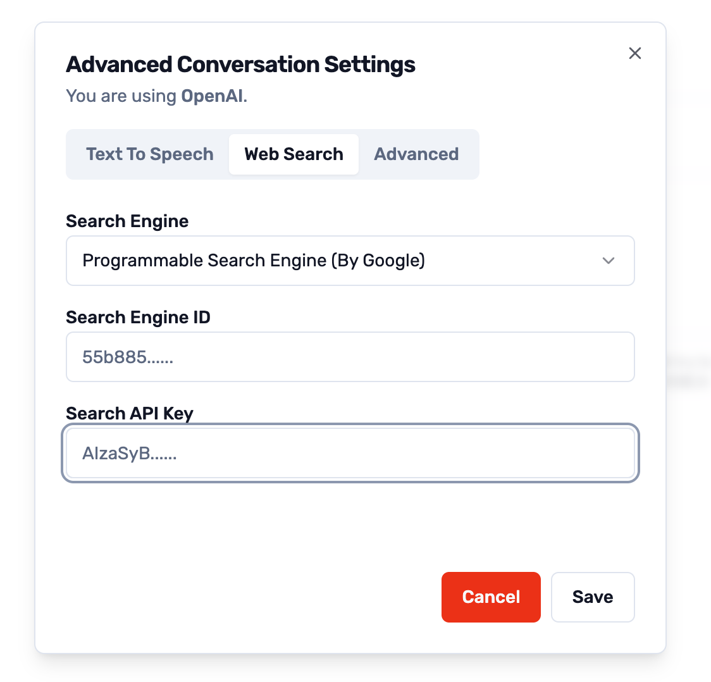

# 在线搜索内容

## 前提条件

-   Google Programmable Search Engine ID
-   Google Programmable Search Engine API Key

## 获取方法

### Google Programmable Search Engine API Key

1. 访问 https://developers.google.com/custom-search/v1/overview
2. 点击 `Get a Key`，登录 Google 账号
3. 点击 `Create a new project`，填写项目名称，点击 `Next`
4. 复制 `API Key`

### Google Programmable Search Engine ID

1. 访问 https://programmablesearchengine.google.com/cse/all
2. 点击 `Add`
3. 输入基本信息，点击 `Create`
4. 复制 `Search engine ID`

## 使用方法

1. 将获取的 Google Programmable Search Engine ID 和 API Key 填写到右上角的 `设置` - `Web Search` 中
2. 保存
3. 开启聊天界面，勾选 `Plugins`
4. 在输入框中输入 `/search`+ 空格 + 搜索内容，例如 `/search Who is the president of the United States?`

## 演示

[演示视频](../assets/search.mp4)
